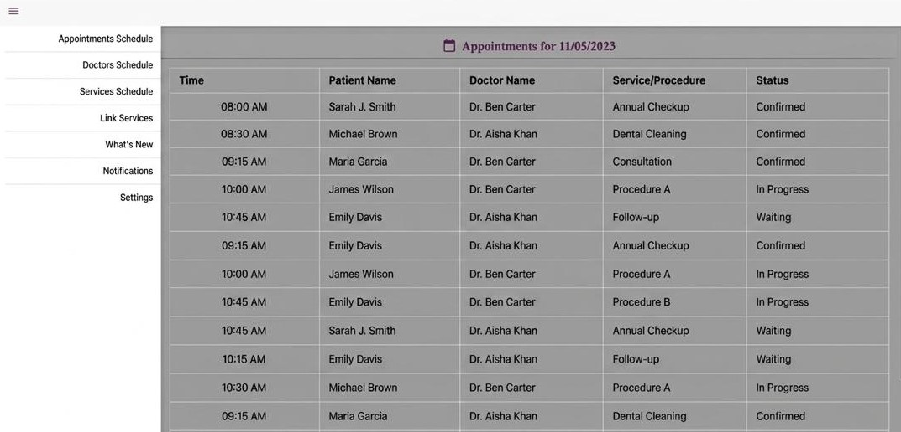
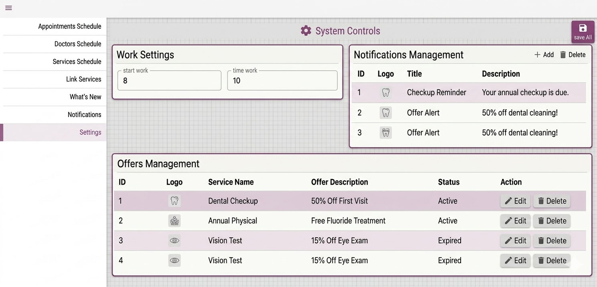

# 🏥 Clinic Management System – Admin Panel

A web-based admin panel for managing clinic operations — built with Ionic & Angular.

---

## 📸 Screenshots

<table>
  <tr>
    <td></td>
    <td></td>
  </tr>
</table>

---

## ✨ Features

- 👨‍⚕️ Add, edit, and delete doctors and medical staff
- 🏥 Manage clinic services and categories
- 💰 Pricing and package management
- 🔔 Push notifications system
- 🕐 Working hours and schedule management

---

## 🛠️ Technologies

| Technology | Usage |
|------------|-------|
| Ionic | Frontend Framework |
| Angular | UI Components |
| TypeScript | Programming Language |
| SCSS | Styling |
| REST API | Backend Communication |
| Laravel | Backend API |

---

## 👨‍💻 Developer

**Mustafa Alkateb** — Software Developer · Web & Mobile  
🔗 [github.com/steefalkateb](https://github.com/steefalkateb)
